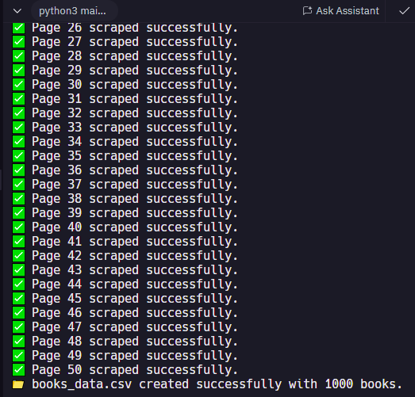

# 📚 Book Store Web Scraper (CSV Export)

This project is a professional web scraping tool developed in Python. It collects book data from the public test site [Books to Scrape](http://books.toscrape.com), simulating a real-world client project involving data extraction, automation, and reporting.

## 🚀 Features

- ✅ Scrapes 1000 book entries across 50 pages
- 📦 Extracts Title, Price, Availability, Rating, and Category
- 🔄 Handles pagination automatically
- 📁 Exports data to `books_data.csv` (compatible with Microsoft Excel)
- 🧠 Designed with ethical scraping practices (targeting a legal learning website)

## 📌 Target Website

- Website: [http://books.toscrape.com](http://books.toscrape.com)
- Purpose: Public sandbox created for practicing web scraping
- Legal Use: Fully permitted for educational and testing purposes

## 🛠️ Technologies Used

- Python 3.x
- `requests` – For making HTTP requests
- `BeautifulSoup` – For HTML parsing
- `csv` – For data export to Excel-readable format

## 📄 Sample Extracted Data

| Title                           | Price  | Availability     | Rating  | Category  |
|--------------------------------|--------|------------------|---------|-----------|
| A Light in the Attic           | £51.77 | In stock         | 3-star  | Poetry    |
| Tipping the Velvet             | £53.74 | In stock         | 1-star  | Fiction   |
| ...                            | ...    | ...              | ...     | ...       |

## 📁 Output File

- **File Name**: `books_data.csv`
- **Format**: UTF-8 encoded CSV
- **Usage**: Can be opened directly in Excel, Google Sheets, or LibreOffice

## 🔐 Legal & Ethical Notice

This project scrapes data **only from a designated public test site**. It does **not** interact with login systems, user data, or paid content, and does **not** bypass any protected CAPTCHAs or violate Terms of Service. All scraping is done ethically and for educational purposes only.

## 📸 Project Screenshot

## 👤 Author

**Eric Mutisya**  
Python Developer & Web Automation Freelancer  
[View My GitHub Projects](https://github.com/Ek-Coder-Tech)

---

## 💼 Use Cases

This project demonstrates readiness for client projects involving:

- Data scraping for research
- Product listings extraction
- Automation for content gathering
- Report generation to CSV/Excel

---

## 📬 Contact

For freelance inquiries, please reach out via [Upwork Profile](https://www.upwork.com/freelancers/~012558bab6232e8e65)

